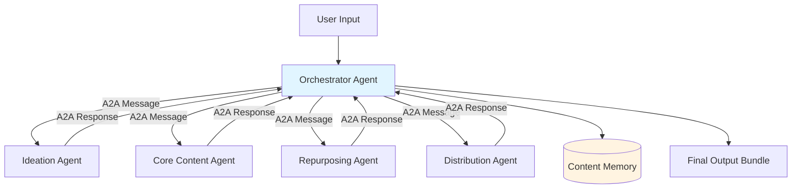

# Design Document: Autonomous Content Studio

## Overview

The Autonomous Content Studio is an agent-native content creation system built on AWS Strands Agents coordinated through the A2A (Agent-to-Agent) protocol. The system transforms a single content idea into a complete content package including long-form core content, platform-specific adaptations, and a distribution schedule—all without human intervention after initial input.

The architecture follows a hub-and-spoke model where a central Orchestrator manages the lifecycle of four specialized agents: Ideation, Core Content, Repurposing, and Distribution. All inter-agent communication flows through the Orchestrator using structured A2A messages, ensuring loose coupling, clear audit trails, and horizontal scalability.

### Key Design Principles

1. **Agent Isolation**: Each agent operates independently with no direct dependencies on other agents
2. **Protocol-Driven Communication**: All coordination occurs through structured A2A messages
3. **Deterministic Execution**: Fixed agent execution order ensures predictable, traceable workflows
4. **Single Source of Truth**: Core content serves as the canonical artifact from which all adaptations derive
5. **Idempotent Operations**: Agents produce consistent outputs for identical inputs, enabling safe retries

## Architecture

### System Architecture Diagram



### Execution Flow

The system follows a linear, deterministic execution sequence:

1. **Input Phase**: User provides content idea, platform selections, and optional audience
2. **Ideation Phase**: Ideation Agent expands the idea into narrative options and selects a theme
3. **Core Content Phase**: Core Content Agent generates the canonical long-form content
4. **Repurposing Phase**: Repurposing Agent adapts content for each selected platform
5. **Distribution Phase**: Distribution Agent creates an optimized posting schedule
6. **Output Phase**: Orchestrator assembles and returns the complete content package

### Agent Communication Pattern

All agent interactions follow this pattern:

```
Orchestrator → [Prepare A2A Message with context] → Agent
Agent → [Process and generate output] → Agent
Agent → [Package output in A2A Response] → Orchestrator
Orchestrator → [Validate output and update state] → Orchestrator
```

## Components and Interfaces

### Orchestrator Agent

**Purpose**: Central coordinator that manages agent lifecycle, execution order, state, and A2A message routing.

**Responsibilities**:
- Accept user input and initialize workflow state
- Trigger agents in deterministic sequence
- Route A2A messages between agents
- Validate agent outputs before proceeding
- Maintain shared state throughout execution
- Persist memory updates
- Generate execution trace logs
- Assemble final output bundle

**Interface**:

```python
class Orchestrator:
    def execute_workflow(
        self,
        content_idea: str,
        platforms: List[str],
        target_audience: Optional[str] = None
    ) -> WorkflowOutput:
        """
        Execute the complete content creation workflow.
        
        Args:
            content_idea: The raw content topic or idea
            platforms: List of 2-3 target platforms (e.g., ["LinkedIn", "Twitter"])
            target_audience: Optional audience description
            
        Returns:
            WorkflowOutput containing core content, platform adaptations,
            distribution schedule, and execution trace
        """
        pass
    
    def send_a2a_message(
        self,
        target_agent: str,
        payload: Dict[str, Any],
        context: ExecutionContext
    ) -> A2AResponse:
        """Send A2A message to target agent and await response."""
        pass
    
    def validate_agent_output(
        self,
        agent_name: str,
        output: A2AResponse
    ) -> bool:
        """Validate agent output meets expected schema and constraints."""
        pass
    
    def update_shared_state(
        self,
        updates: Dict[str, Any]
    ) -> None:
        """Update shared state with new data from agent execution."""
        pass
    
    def persist_memory(
        self,
        memory_type: str,
        data: Dict[str, Any]
    ) -> None:
        """Persist memory updates to storage."""
        pass
```

**State Management**:

The Orchestrator maintains a `SharedState` object throughout execution:

```python
@dataclass
class SharedState:
    content_idea: str
    platforms: List[str]
    target_audience: Optional[str]
    selected_theme: Optional[str] = None
    theme_rationale: Optional[str] = None
    core_content: Optional[str] = None
    content_metadata: Optional[Dict[str, Any]] = None
    platform_adaptations: Dict[str, str] = field(default_factory=dict)
    distribution_schedule: Optional[List[ScheduleEntry]] = None
    execution_trace: List[TraceEntry] = field(default_factory=list)
```

### Ideation Agent

**Purpose**: Expand raw content ideas into structured narrative options and select the most promising theme.

**Inputs** (via A2A message):
- Content idea (string)
- Content memory (historical topics and hooks)
- Target audience (optional)

**Processing Logic**:
1. Generate 3-5 narrative angle options based on the content idea
2. Evaluate each option against content memory to avoid repetition
3. Select the strongest theme based on novelty, relevance, and audience fit
4. Identify 2-3 supporting angles for the selected theme
5. Document rationale for the selection

**Outputs** (via A2A response):
- Selected theme (string)
- Supporting angles (list of strings)
- Selection rationale (string)
- Alternative themes considered (list for logging)

**Interface**:

```python
class IdeationAgent:
    def process(
        self,
        message: A2AMessage
    ) -> A2AResponse:
        """
        Process ideation request and return theme selection.
        
        Message payload contains:
            - content_idea: str
            - content_memory: Dict[str, Any]
            - target_audience: Optional[str]
            
        Response payload contains:
            - selected_theme: str
            - supporting_angles: List[str]
            - rationale: str
            - alternatives_considered: List[str]
        """
        pass
    
    def generate_narrative_options(
        self,
        content_idea: str,
        content_memory: Dict[str, Any]
    ) -> List[NarrativeOption]:
        """Generate multiple narrative angle options."""
        pass
    
    def select_best_theme(
        self,
        options: List[NarrativeOption],
        content_memory: Dict[str, Any]
    ) -> Tuple[NarrativeOption, str]:
        """Select best theme and provide rationale."""
        pass
```

### Core Content Agent

**Purpose**: Generate the canonical long-form content artifact that serves as the source of truth for all platform adaptations.

**Inputs** (via A2A message):
- Selected theme (string)
- Supporting angles (list of strings)
- Target audience (optional)

**Content Structure**:
The agent generates content following this structure:
1. **Hook**: Attention-grabbing opening (1-2 sentences)
2. **Explanation**: Core concept and context (2-3 paragraphs)
3. **Examples**: Concrete illustrations or use cases (2-3 examples)
4. **Call-to-Action**: Clear next step for the audience (1-2 sentences)

**Outputs** (via A2A response):
- Core content (string, 800-1200 words)
- Structural metadata (hook, explanation sections, examples, CTA)
- Content type (article, script, guide)
- Key points (list of main takeaways)

**Interface**:

```python
class CoreContentAgent:
    def process(
        self,
        message: A2AMessage
    ) -> A2AResponse:
        """
        Generate core content from theme and angles.
        
        Message payload contains:
            - selected_theme: str
            - supporting_angles: List[str]
            - target_audience: Optional[str]
            
        Response payload contains:
            - core_content: str
            - metadata: ContentMetadata
        """
        pass
    
    def generate_hook(
        self,
        theme: str
    ) -> str:
        """Generate attention-grabbing opening."""
        pass
    
    def generate_explanation(
        self,
        theme: str,
        angles: List[str]
    ) -> str:
        """Generate core explanation section."""
        pass
    
    def generate_examples(
        self,
        theme: str,
        angles: List[str]
    ) -> List[str]:
        """Generate concrete examples."""
        pass
    
    def generate_cta(
        self,
        theme: str
    ) -> str:
        """Generate call-to-action."""
        pass

@dataclass
class ContentMetadata:
    hook: str
    explanation_sections: List[str]
    examples: List[str]
    cta: str
    content_type: str
    key_points: List[str]
    word_count: int
```

### Repurposing Agent

**Purpose**: Adapt core content for each target platform according to platform-specific constraints and conventions.

**Inputs** (via A2A message):
- Core content (string)
- Content metadata (ContentMetadata)
- Target platforms (list of strings)

**Platform Rules**:

| Platform | Length Constraint | Tone | Format |
|----------|------------------|------|--------|
| LinkedIn | 1300-3000 chars | Professional, insightful | Paragraphs with line breaks, emojis optional |
| Twitter/X | 280 chars per tweet | Concise, engaging | Thread format, hashtags |
| Blog | 800-1200 words | Detailed, authoritative | Full article with headings |
| Instagram | 2200 chars | Visual-first, casual | Short paragraphs, emoji-heavy |

**Processing Logic**:
1. For each target platform, extract relevant constraints
2. Identify key points from core content that fit platform context
3. Adapt tone and language for platform audience
4. Apply formatting conventions (hashtags, line breaks, etc.)
5. Ensure adapted content maintains core message integrity

**Outputs** (via A2A response):
- Platform adaptations (dict mapping platform name to adapted content)
- Adaptation metadata (character counts, hashtags used, etc.)

**Interface**:

```python
class RepurposingAgent:
    def process(
        self,
        message: A2AMessage
    ) -> A2AResponse:
        """
        Adapt core content for target platforms.
        
        Message payload contains:
            - core_content: str
            - content_metadata: ContentMetadata
            - platforms: List[str]
            
        Response payload contains:
            - platform_adaptations: Dict[str, str]
            - adaptation_metadata: Dict[str, AdaptationMetadata]
        """
        pass
    
    def adapt_for_platform(
        self,
        core_content: str,
        metadata: ContentMetadata,
        platform: str
    ) -> Tuple[str, AdaptationMetadata]:
        """Adapt content for specific platform."""
        pass
    
    def get_platform_constraints(
        self,
        platform: str
    ) -> PlatformConstraints:
        """Retrieve constraints for platform."""
        pass
    
    def apply_tone_adjustment(
        self,
        content: str,
        target_tone: str
    ) -> str:
        """Adjust content tone for platform."""
        pass

@dataclass
class PlatformConstraints:
    max_length: int
    tone: str
    format_rules: List[str]
    supports_hashtags: bool
    supports_emojis: bool

@dataclass
class AdaptationMetadata:
    character_count: int
    hashtags: List[str]
    format_type: str
    tone_applied: str
```

### Distribution Agent

**Purpose**: Determine optimal posting order and timing for each platform based on rule-based heuristics.

**Inputs** (via A2A message):
- Platform adaptations (dict mapping platform to content)
- Platforms (list of strings)

**Scheduling Logic** (MVP - Rule-Based):

Time-of-day optimization by platform:
- **LinkedIn**: Weekday mornings (8-10 AM) or lunch (12-1 PM)
- **Twitter/X**: Multiple times daily (9 AM, 1 PM, 5 PM)
- **Blog**: Monday-Wednesday mornings (9-11 AM)
- **Instagram**: Evenings (6-9 PM) or weekends

Sequencing rules:
1. Blog/long-form content posts first (establishes canonical source)
2. LinkedIn posts 2-4 hours after blog
3. Twitter/X threads post throughout the day
4. Instagram posts in evening slot

**Outputs** (via A2A response):
- Distribution schedule (list of schedule entries)
- Scheduling rationale (string explaining the timing decisions)

**Interface**:

```python
class DistributionAgent:
    def process(
        self,
        message: A2AMessage
    ) -> A2AResponse:
        """
        Generate distribution schedule for platform content.
        
        Message payload contains:
            - platform_adaptations: Dict[str, str]
            - platforms: List[str]
            
        Response payload contains:
            - distribution_schedule: List[ScheduleEntry]
            - rationale: str
        """
        pass
    
    def get_optimal_time(
        self,
        platform: str,
        reference_date: datetime
    ) -> datetime:
        """Determine optimal posting time for platform."""
        pass
    
    def determine_sequence_order(
        self,
        platforms: List[str]
    ) -> List[str]:
        """Determine posting order across platforms."""
        pass

@dataclass
class ScheduleEntry:
    platform: str
    content: str
    scheduled_time: datetime
    sequence_order: int
    rationale: str
```

### A2A Protocol Implementation

**Purpose**: Provide structured message format for all inter-agent communication.

**Message Structure**:

```python
@dataclass
class A2AMessage:
    message_id: str
    sender_agent_id: str
    recipient_agent_id: str
    timestamp: datetime
    schema_version: str
    execution_context: ExecutionContext
    payload: Dict[str, Any]
    
    def to_json(self) -> str:
        """Serialize message to JSON."""
        pass
    
    @classmethod
    def from_json(cls, json_str: str) -> 'A2AMessage':
        """Deserialize message from JSON."""
        pass

@dataclass
class A2AResponse:
    message_id: str
    response_to_message_id: str
    sender_agent_id: str
    timestamp: datetime
    schema_version: str
    status: str  # "success", "error", "partial"
    payload: Dict[str, Any]
    error_details: Optional[str] = None
    
    def to_json(self) -> str:
        """Serialize response to JSON."""
        pass
    
    @classmethod
    def from_json(cls, json_str: str) -> 'A2AResponse':
        """Deserialize response from JSON."""
        pass

@dataclass
class ExecutionContext:
    workflow_id: str
    step_number: int
    shared_state_snapshot: Dict[str, Any]
    retry_count: int = 0
```

**Protocol Benefits**:
- **Loose Coupling**: Agents only depend on message schemas, not implementations
- **Audit Trail**: Every message is logged with sender, timestamp, and context
- **Versioning**: Schema versions enable backward compatibility
- **Observability**: Message flow provides complete execution trace
- **Scalability**: Protocol supports horizontal scaling and async execution (future)

## Data Models

### Core Data Structures

```python
@dataclass
class WorkflowInput:
    content_idea: str
    platforms: List[str]
    target_audience: Optional[str] = None
    
    def validate(self) -> bool:
        """Validate input constraints."""
        if not self.content_idea or len(self.content_idea.strip()) == 0:
            return False
        if not self.platforms or len(self.platforms) < 2 or len(self.platforms) > 3:
            return False
        return True

@dataclass
class WorkflowOutput:
    core_content: str
    content_metadata: ContentMetadata
    platform_adaptations: Dict[str, str]
    distribution_schedule: List[ScheduleEntry]
    execution_trace: List[TraceEntry]
    workflow_id: str
    timestamp: datetime
    
    def to_json(self) -> str:
        """Serialize output to JSON."""
        pass

@dataclass
class TraceEntry:
    step_number: int
    agent_name: str
    timestamp: datetime
    input_summary: str
    output_summary: str
    execution_time_ms: int
    status: str

@dataclass
class NarrativeOption:
    theme: str
    angles: List[str]
    novelty_score: float
    relevance_score: float
```

### Memory Models

```python
@dataclass
class ContentMemory:
    past_topics: List[str]
    past_hooks: List[str]
    topic_frequency: Dict[str, int]
    last_updated: datetime
    
    def add_topic(self, topic: str) -> None:
        """Add topic to memory."""
        pass
    
    def add_hook(self, hook: str) -> None:
        """Add hook to memory."""
        pass
    
    def is_topic_recent(self, topic: str, days: int = 30) -> bool:
        """Check if topic was used recently."""
        pass
    
    def to_json(self) -> str:
        """Serialize to JSON for storage."""
        pass
    
    @classmethod
    def from_json(cls, json_str: str) -> 'ContentMemory':
        """Deserialize from JSON."""
        pass

@dataclass
class PerformanceMemory:
    """MVP: Mocked data structure for future analytics integration."""
    platform_preferences: Dict[str, float]
    tone_effectiveness: Dict[str, float]
    best_posting_times: Dict[str, List[int]]  # platform -> hours
    
    def to_json(self) -> str:
        """Serialize to JSON for storage."""
        pass
    
    @classmethod
    def from_json(cls, json_str: str) -> 'PerformanceMemory':
        """Deserialize from JSON."""
        pass
```

### Storage

Memory is persisted using JSON files in the MVP:

```
.content_studio/
├── memory/
│   ├── content_memory.json
│   └── performance_memory.json
├── workflows/
│   └── {workflow_id}/
│       ├── input.json
│       ├── output.json
│       └── trace.json
```

Future enhancement: Migrate to vector database for semantic search over past content.

## Data Models

### Agent Registry

The Orchestrator maintains a registry of available agents:

```python
@dataclass
class AgentRegistryEntry:
    agent_id: str
    agent_class: Type
    agent_name: str
    description: str
    input_schema_version: str
    output_schema_version: str
    dependencies: List[str]  # Agent IDs this agent depends on
    
@dataclass
class AgentRegistry:
    agents: Dict[str, AgentRegistryEntry]
    
    def register_agent(self, entry: AgentRegistryEntry) -> None:
        """Register a new agent."""
        pass
    
    def get_agent(self, agent_id: str) -> AgentRegistryEntry:
        """Retrieve agent by ID."""
        pass
    
    def get_execution_order(self) -> List[str]:
        """Determine execution order based on dependencies."""
        pass
```

The registry enables extensibility by allowing new agents to be added without modifying existing code.


## Correctness Properties

A property is a characteristic or behavior that should hold true across all valid executions of a system—essentially, a formal statement about what the system should do. Properties serve as the bridge between human-readable specifications and machine-verifiable correctness guarantees.

### Workflow Orchestration Properties

**Property 1: Workflow Initiation**
*For any* valid content idea string, when provided to the Orchestrator, the workflow SHALL initiate and trigger the first agent (Ideation Agent).
**Validates: Requirements 1.1**

**Property 2: Platform Validation**
*For any* list of platforms, the Orchestrator SHALL accept the list if and only if it contains 2-3 valid platform names, and SHALL reject lists with fewer than 2 or more than 3 platforms.
**Validates: Requirements 1.2**

**Property 3: Optional Audience Propagation**
*For any* workflow execution, if a target audience is provided, then all A2A messages sent to agents SHALL include the audience in the execution context or payload.
**Validates: Requirements 1.3**

**Property 4: Complete Output Structure**
*For any* successfully completed workflow, the output SHALL contain all required components: core content, content metadata, platform adaptations for all requested platforms, distribution schedule, and execution trace.
**Validates: Requirements 1.4**

**Property 5: Autonomous Execution**
*For any* workflow execution, once initiated with valid input, the workflow SHALL complete without external intervention, blocking for user input, or requiring manual steps.
**Validates: Requirements 1.5**

### Ideation Agent Properties

**Property 6: Multiple Narrative Options**
*For any* content topic, the Ideation Agent SHALL generate at least 2 distinct narrative angle options.
**Validates: Requirements 2.1**

**Property 7: Topic Novelty**
*For any* content topic and content memory containing recent topics, the Ideation Agent SHALL select a theme that differs from topics used within the last 30 days.
**Validates: Requirements 2.2**

**Property 8: Single Theme Selection**
*For any* ideation execution, the output SHALL contain exactly one selected theme.
**Validates: Requirements 2.3**

**Property 9: Supporting Angles Presence**
*For any* ideation execution, the output SHALL contain a non-empty list of supporting angles for the selected theme.
**Validates: Requirements 2.4**

**Property 10: Selection Rationale**
*For any* ideation execution, the output SHALL contain a non-empty rationale string explaining the theme selection.
**Validates: Requirements 2.5**

**Property 11: Ideation A2A Response**
*For any* ideation execution, the agent SHALL return an A2AResponse containing selected_theme, supporting_angles, and rationale in the payload.
**Validates: Requirements 2.6**

### Core Content Agent Properties

**Property 12: Content Generation**
*For any* theme and supporting angles, the Core Content Agent SHALL generate non-empty long-form content.
**Validates: Requirements 3.1**

**Property 13: Content Structure Completeness**
*For any* generated content, the metadata SHALL contain all four required sections: hook, explanation, examples, and call-to-action, with each section being non-empty.
**Validates: Requirements 3.2**

**Property 14: Long-Form Length**
*For any* generated content, the word count SHALL be between 800 and 1200 words.
**Validates: Requirements 3.3**

**Property 15: Metadata Presence**
*For any* core content generation, the output SHALL include a ContentMetadata object with all required fields: hook, explanation_sections, examples, cta, content_type, key_points, and word_count.
**Validates: Requirements 3.4**

**Property 16: Core Content A2A Response**
*For any* core content generation, the agent SHALL return an A2AResponse containing core_content and metadata in the payload.
**Validates: Requirements 3.5**

### Repurposing Agent Properties

**Property 17: Complete Platform Coverage**
*For any* set of requested platforms, the Repurposing Agent SHALL generate exactly one adaptation for each platform in the set.
**Validates: Requirements 4.1**

**Property 18: Platform Length Constraints**
*For any* platform adaptation, the character count SHALL not exceed the maximum length constraint for that platform (LinkedIn: 3000, Twitter: 280 per tweet, Instagram: 2200).
**Validates: Requirements 4.2**

**Property 19: Tone Metadata Recording**
*For any* platform adaptation, the adaptation metadata SHALL record the tone that was applied for that platform.
**Validates: Requirements 4.3**

**Property 20: Platform-Specific Formatting**
*For any* platform adaptation, the content SHALL include platform-specific formatting elements (hashtags for Twitter, line breaks for LinkedIn, emojis for Instagram where applicable).
**Validates: Requirements 4.4**

**Property 21: Adaptation Bundle Completeness**
*For any* platform, the output SHALL contain both the adapted content string and an AdaptationMetadata object for that platform.
**Validates: Requirements 4.5**

**Property 22: Repurposing A2A Response**
*For any* repurposing execution, the agent SHALL return an A2AResponse containing platform_adaptations and adaptation_metadata in the payload.
**Validates: Requirements 4.6**

### Distribution Agent Properties

**Property 23: Schedule Generation**
*For any* set of platform adaptations, the Distribution Agent SHALL generate a non-empty distribution schedule containing at least one entry per platform.
**Validates: Requirements 5.1**

**Property 24: Time-of-Day Optimization**
*For any* schedule entry, the scheduled time SHALL fall within the optimal time window for that platform (LinkedIn: 8-10 AM or 12-1 PM weekdays, Twitter: 9 AM/1 PM/5 PM, Instagram: 6-9 PM).
**Validates: Requirements 5.2, 5.3**

**Property 25: Platform Sequencing**
*For any* distribution schedule containing blog and social platforms, blog/long-form content SHALL be scheduled before social media posts, and LinkedIn SHALL be scheduled before Twitter.
**Validates: Requirements 5.4**

**Property 26: Distribution A2A Response**
*For any* distribution execution, the agent SHALL return an A2AResponse containing distribution_schedule and rationale in the payload.
**Validates: Requirements 5.5**

### A2A Protocol Properties

**Property 27: A2A Message Structure Completeness**
*For any* A2A message sent by an agent, the message SHALL contain all required fields: sender_agent_id, payload, execution_context, and schema_version, with each field being non-null.
**Validates: Requirements 6.1, 6.2, 6.3, 6.4**

**Property 28: Orchestrator Message Coordination**
*For any* agent-to-agent communication, the message SHALL be routed through the Orchestrator, and agents SHALL NOT communicate directly with each other.
**Validates: Requirements 6.5, 6.6**

### Orchestrator State Management Properties

**Property 29: Deterministic Agent Execution Order**
*For any* two workflow executions with the same input, the sequence of agent executions SHALL be identical.
**Validates: Requirements 7.1, 12.1, 12.2**

**Property 30: Output Validation Before Proceeding**
*For any* agent execution, if the agent output is invalid (missing required fields or incorrect schema), the Orchestrator SHALL halt the workflow and not trigger subsequent agents.
**Validates: Requirements 7.2**

**Property 31: Shared State Accumulation**
*For any* workflow execution, after each agent completes, the shared state SHALL contain all data from previous agent outputs plus the current agent's output.
**Validates: Requirements 7.3**

**Property 32: State Propagation in Messages**
*For any* A2A message sent to an agent, the execution_context SHALL contain a snapshot of the current shared state.
**Validates: Requirements 7.4**

**Property 33: Memory Persistence**
*For any* completed workflow, the content memory file SHALL be updated with the new topic and hooks used in that workflow.
**Validates: Requirements 7.5**

**Property 34: Complete Execution Trace**
*For any* completed workflow, the execution trace SHALL contain exactly one entry for each agent that was executed, in execution order.
**Validates: Requirements 7.6, 7.7, 10.2**

### Memory Management Properties

**Property 35: Content Memory Structure**
*For any* content memory object, it SHALL contain non-null lists for past_topics and past_hooks.
**Validates: Requirements 8.1**

**Property 36: Performance Memory Structure**
*For any* performance memory object, it SHALL contain dictionaries for platform_preferences, tone_effectiveness, and best_posting_times.
**Validates: Requirements 8.2**

**Property 37: Memory Inclusion in Agent Messages**
*For any* A2A message sent to the Ideation Agent, the payload SHALL include the content_memory object.
**Validates: Requirements 8.3**

**Property 38: Memory Serialization Round-Trip**
*For any* content memory object, serializing to JSON and then deserializing SHALL produce an equivalent memory object with the same topics and hooks.
**Validates: Requirements 8.4**

**Property 39: Memory Update Idempotency**
*For any* topic, adding it to content memory multiple times SHALL result in the topic appearing exactly once in the past_topics list.
**Validates: Requirements 8.5**

### Agent Isolation and Idempotency Properties

**Property 40: Agent Independence**
*For any* agent class, the agent SHALL only import the Orchestrator interface and A2A message types, and SHALL NOT import other agent classes.
**Validates: Requirements 9.1**

**Property 41: Agent Idempotency**
*For any* agent and A2A message, calling the agent's process method twice with the same message SHALL produce equivalent outputs (same selected theme, same content structure, same adaptations).
**Validates: Requirements 9.2**

**Property 42: Context Completeness**
*For any* agent execution, all data used by the agent SHALL be present in the A2A message payload or execution context, and the agent SHALL NOT access external state or files.
**Validates: Requirements 9.3**

**Property 43: Agent Statelessness**
*For any* agent, executing the agent multiple times in sequence SHALL NOT result in accumulated internal state—each execution SHALL be independent.
**Validates: Requirements 9.4**

**Property 44: Isolated Agent Retry**
*For any* agent failure, retrying that specific agent SHALL NOT require re-executing previous agents in the workflow.
**Validates: Requirements 9.5**

### Observability Properties

**Property 45: Trace Entry Timestamps**
*For any* trace entry in the execution log, the entry SHALL contain a valid timestamp field.
**Validates: Requirements 10.3**

**Property 46: Trace Entry Summaries**
*For any* trace entry in the execution log, the entry SHALL contain non-empty input_summary and output_summary fields.
**Validates: Requirements 10.4**

**Property 47: Platform Format Compliance**
*For any* platform adaptation, the content SHALL comply with the format rules for that platform (thread format for Twitter, paragraph format for LinkedIn, etc.).
**Validates: Requirements 10.5**

### Extensibility Properties

**Property 48: Agent Registry Existence**
*For any* Orchestrator instance, it SHALL maintain an AgentRegistry containing entries for all available agents.
**Validates: Requirements 11.1**

**Property 49: Dynamic Agent Discovery**
*For any* agent ID in the registry, the Orchestrator SHALL be able to retrieve the agent entry and instantiate the agent at runtime.
**Validates: Requirements 11.3**

**Property 50: Schema Version Compatibility**
*For any* A2A message with a schema_version field, the receiving agent SHALL accept messages with the current version or any supported backward-compatible version.
**Validates: Requirements 11.4**

### Deterministic Execution Properties

**Property 51: Sequential Agent Execution**
*For any* workflow execution, the timestamp of agent N+1's execution SHALL be after the timestamp of agent N's completion, proving sequential (non-parallel) execution.
**Validates: Requirements 12.3, 12.4**

**Property 52: Failure Halts Workflow**
*For any* agent execution that returns an error status, the Orchestrator SHALL halt the workflow, not trigger subsequent agents, and return a failure state with error details.
**Validates: Requirements 12.5**

## Error Handling

### Error Categories

The system handles four categories of errors:

1. **Input Validation Errors**: Invalid content idea, wrong number of platforms, unsupported platform names
2. **Agent Execution Errors**: Agent fails to process, returns invalid output, times out
3. **Communication Errors**: A2A message serialization fails, message schema mismatch
4. **State Management Errors**: Memory persistence fails, state corruption detected

### Error Handling Strategy

**Input Validation**:
- Validate all inputs before initiating workflow
- Return clear error messages indicating which validation failed
- Do not start workflow if validation fails

**Agent Execution**:
- Wrap each agent execution in try-catch block
- Log error details to execution trace
- Halt workflow and return error state
- Include agent name, error message, and stack trace in output

**Communication**:
- Validate A2A message schema before sending
- Validate A2A response schema after receiving
- Retry serialization errors once
- Halt workflow if schema validation fails after retry

**State Management**:
- Validate shared state after each agent execution
- Backup memory before updates
- Rollback memory if persistence fails
- Log all state transitions for debugging

### Error Response Format

```python
@dataclass
class ErrorResponse:
    error_type: str  # "input_validation", "agent_execution", "communication", "state_management"
    error_message: str
    failed_agent: Optional[str]
    workflow_id: str
    timestamp: datetime
    execution_trace: List[TraceEntry]
    stack_trace: Optional[str] = None
```

### Retry Logic

**Agent Execution Retries**:
- Retry failed agent up to 2 times
- Use exponential backoff (1s, 2s)
- If all retries fail, halt workflow

**Memory Persistence Retries**:
- Retry memory write up to 3 times
- If all retries fail, log warning but continue workflow
- Memory updates are not critical for workflow completion

## Testing Strategy

### Dual Testing Approach

The system requires both unit testing and property-based testing for comprehensive coverage:

**Unit Tests**: Verify specific examples, edge cases, and error conditions
- Test specific content ideas and expected outputs
- Test edge cases (empty strings, maximum lengths, boundary conditions)
- Test error handling (invalid inputs, agent failures, timeouts)
- Test integration points between components

**Property Tests**: Verify universal properties across all inputs
- Test properties hold for randomly generated content ideas, platforms, and audiences
- Test idempotency with repeated executions
- Test state management with random execution sequences
- Test A2A protocol compliance across all message types

### Property-Based Testing Configuration

**Testing Library**: Use `hypothesis` for Python property-based testing

**Test Configuration**:
- Minimum 100 iterations per property test
- Each test references its design document property
- Tag format: `# Feature: autonomous-content-studio, Property {N}: {property_text}`

**Example Property Test Structure**:

```python
from hypothesis import given, strategies as st
import pytest

# Feature: autonomous-content-studio, Property 2: Platform Validation
@given(
    platforms=st.lists(
        st.sampled_from(["LinkedIn", "Twitter", "Instagram", "Blog"]),
        min_size=0,
        max_size=5
    )
)
def test_platform_validation_property(platforms):
    """
    For any list of platforms, the Orchestrator SHALL accept the list
    if and only if it contains 2-3 valid platform names.
    """
    orchestrator = Orchestrator()
    workflow_input = WorkflowInput(
        content_idea="Test idea",
        platforms=platforms
    )
    
    is_valid = workflow_input.validate()
    expected_valid = 2 <= len(platforms) <= 3
    
    assert is_valid == expected_valid
```

### Test Coverage Requirements

**Unit Test Coverage**:
- All public methods in Orchestrator: 100%
- All agent process methods: 100%
- All A2A message serialization/deserialization: 100%
- All error handling paths: 100%

**Property Test Coverage**:
- All 52 correctness properties must have corresponding property tests
- Each property test must run minimum 100 iterations
- Property tests must use randomized inputs (no hardcoded test data)

### Integration Testing

**End-to-End Workflow Tests**:
- Test complete workflow with real LLM calls (mocked in CI)
- Verify all agents execute in correct order
- Verify final output contains all required components
- Verify execution trace is complete and accurate

**Agent Integration Tests**:
- Test each agent with Orchestrator integration
- Verify A2A message passing works correctly
- Verify state updates propagate correctly
- Verify memory persistence works correctly

### Test Data Strategy

**Unit Tests**: Use fixed, curated test data
- Predefined content ideas covering different domains
- Known-good outputs for validation
- Edge cases (empty strings, very long strings, special characters)

**Property Tests**: Use generated test data
- Random content ideas (strings of varying length)
- Random platform combinations
- Random audience descriptions
- Random themes and angles

**Memory Test Data**:
- Seed content memory with historical topics
- Test memory avoidance logic with known topics
- Test memory persistence with random updates

### Mocking Strategy

**LLM Calls**: Mock in unit and property tests
- Return deterministic outputs for testing
- Simulate different response patterns
- Test error handling with failed LLM calls

**External Dependencies**: Mock in all tests
- File system operations (memory persistence)
- Network calls (future API integrations)
- Time-dependent operations (scheduling)

**Agent Mocking**: Use real agents in integration tests
- Only mock LLM backend
- Test real agent logic and A2A communication
- Verify real state management and orchestration

